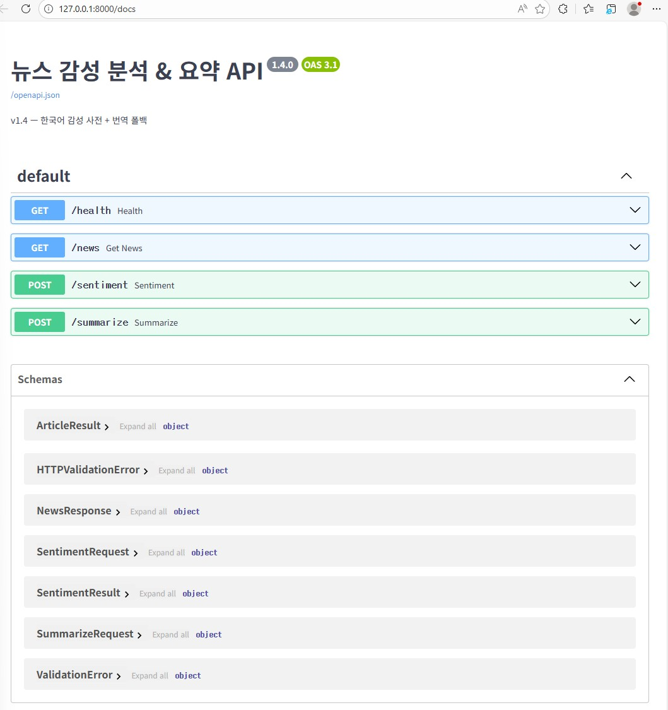
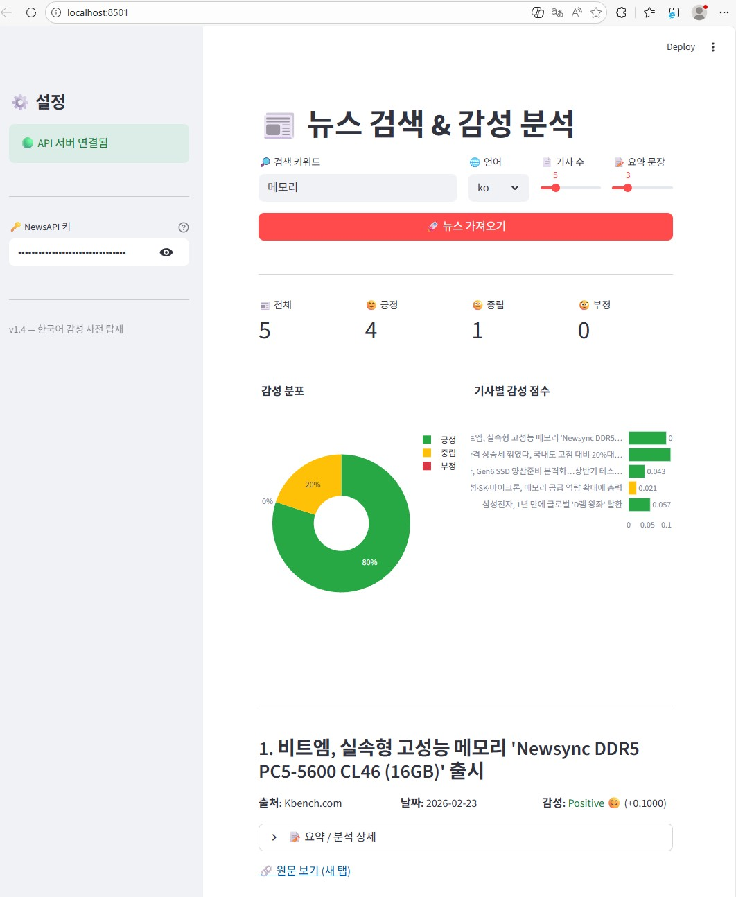

# 📰 뉴스 감성 분석 & 요약

NewsAPI로 최신 뉴스를 가져와 **감성 분석(Positive/Neutral/Negative)** 과 **본문 요약**을 수행하는 웹 애플리케이션입니다.

## 프로젝트 목표

뉴스 기사의 감성을 자동으로 분석하여 **특정 키워드에 대한 미디어 분위기를 한눈에 파악**할 수 있는 도구를 제공합니다. 무료 오픈소스 라이브러리만으로 구현하여 누구나 비용 부담 없이 활용할 수 있습니다.

## 왜 필요한가?

매일 쏟아지는 수많은 뉴스를 일일이 읽고 분위기를 판단하는 것은 비효율적입니다. 뉴스 감성 분포를 자동으로 분석하면 다음과 같은 인사이트를 얻을 수 있습니다.

| 활용 영역 | 감성 분포로 알 수 있는 것 |
|-----------|--------------------------|
| **여론 동향 파악** | 특정 키워드(기업명, 정책, 이슈)에 대한 미디어 분위기를 긍정/부정 비율로 수치화 |
| **시계열 변화 감지** | 같은 키워드를 반복 검색하여 시간에 따른 감성 변화를 추적 (예: 신제품 출시 전후 비교) |
| **리스크 조기 경보** | 부정 비율이 급증하면 스캔들, 실적 악화 등 위기 징후를 조기에 포착 |
| **경쟁사 비교** | 키워드별 감성 비율을 비교하여 브랜드 이미지 차이를 객관적으로 파악 |
| **투자 참고 지표** | 뉴스 감성과 주가 움직임 사이의 상관관계를 보조 지표로 활용 |
| **핵심 기사 식별** | 기사별 감성 점수 차트로 가장 긍정/부정인 기사를 빠르게 찾아 원문 확인 |

> 💡 TextBlob + 감성 사전 기반이므로 풍자, 반어법 등 맥락 의존적 표현은 정확도가 떨어질 수 있습니다. 절대적 판단이 아닌 **추세 파악을 위한 참고 지표**로 활용하는 것이 적절합니다.

## 프로젝트 개요

| 항목 | 내용 |
|------|------|
| **백엔드** | FastAPI (Python) |
| **프론트엔드** | Streamlit |
| **감성 분석** | TextBlob + 한국어 감성 사전(100단어) + Google 번역 폴백 |
| **텍스트 요약** | sumy (LSA Summarizer) |
| **뉴스 소스** | NewsAPI (https://newsapi.org) |
| **시각화** | Plotly (파이 차트, 바 차트) |

### 아키텍처

```
┌─────────────────────┐       HTTP        ┌──────────────────────┐       HTTPS       ┌────────────┐
│  Streamlit (8501)   │ ───────────────▶  │  FastAPI (8000)      │ ────────────────▶  │  NewsAPI   │
│  - 검색 UI          │ ◀───────────────  │  - 감성 분석         │ ◀────────────────  │            │
│  - 차트 시각화       │    JSON 응답      │  - 텍스트 요약       │   JSON 응답        └────────────┘
│  - CSV 다운로드      │                   │  - 뉴스 프록시       │
└─────────────────────┘                   └──────────────────────┘
```

---

## 실행 방법

### 1. 사전 준비

- **Python 3.10+** 설치
- **NewsAPI 키** 발급: https://newsapi.org/register (무료)

### 2. 패키지 설치

```bash
pip install -r requirements.txt
```

### 3. 백엔드 서버 실행

```bash
uvicorn api:app --reload --host 127.0.0.1 --port 8000
```

실행 후 http://127.0.0.1:8000/docs 에서 Swagger UI 확인 가능

### 4. 프론트엔드 실행

```bash
streamlit run app.py
```

실행 후 http://localhost:8501 에서 웹 UI 접속

### 5. 사용하기

1. 사이드바에 **NewsAPI 키** 입력
2. 검색 키워드, 언어, 기사 수 설정
3. **"뉴스 가져오기"** 버튼 클릭
4. 감성 분포 차트, 기사별 감성 점수, 요약 결과 확인

---

## 핵심 로직

### 감성 분석 (`_analyze_sentiment`)

3단계 전략으로 다국어 텍스트의 감성을 분석합니다.

#### 1단계: 한국어 감성 사전

한국어 텍스트가 감지되면 **KO_POSITIVE**(50단어) / **KO_NEGATIVE**(50단어) 사전으로 부분 매칭(substring) 검사합니다.

```
"기쁨"  → KO_POSITIVE에 "기쁨" 포함 → 긍정 1개 매칭 → 점수 = +0.25
"슬프다" → KO_NEGATIVE에 "슬프" 포함 → 부정 1개 매칭 → 점수 = -0.25
```

점수 공식: `(긍정 매칭 수 - 부정 매칭 수) × 0.25`, 범위 [-1.0, 1.0]

#### 2단계: 영어 번역 + TextBlob

한국어 텍스트는 **deep-translator (Google 번역)** 으로 영어 번역 후:
- **TextBlob**: 영어 텍스트의 polarity 계산 (-1.0 ~ 1.0)
- **EN 키워드 사전**: EN_POSITIVE/EN_NEGATIVE 단어 매칭으로 보정 점수 계산

#### 3단계: 종합 점수

| 케이스 | 가중치 |
|--------|--------|
| 한국어 + 번역 성공 | KO 사전 40% + TextBlob 30% + EN 키워드 30% |
| 한국어 + 번역 실패 | KO 사전 100% |
| 영어 텍스트 | TextBlob 60% + EN 키워드 40% |

최종 판정 기준:
- `> +0.03` → **Positive 😊**
- `< -0.03` → **Negative 😟**
- 그 외 → **Neutral 😐**

### 텍스트 요약 (`_summarize_text`)

**sumy 라이브러리의 LSA(Latent Semantic Analysis) Summarizer**를 사용합니다.

1. `PlaintextParser`로 텍스트 파싱
2. `Stemmer`와 `stop_words`로 언어별 전처리
3. LSA 알고리즘으로 핵심 문장 추출 (요청한 문장 수만큼)

10단어 미만의 짧은 텍스트는 요약 없이 원문 그대로 반환합니다.

---

## API 명세

### `GET /health`

서버 상태 확인

**응답 예시:**
```json
{ "status": "ok", "version": "1.4.0" }
```

---

### `GET /news`

뉴스 검색 + 감성 분석 + 요약을 한 번에 수행

| 파라미터 | 타입 | 필수 | 설명 |
|----------|------|------|------|
| `api_key` | string | ✅ | NewsAPI 키 |
| `query` | string | - | 검색 키워드 (기본: "technology") |
| `language` | string | - | 언어 코드: en, ko, ja, de, fr, es (기본: "en") |
| `page_size` | int | - | 기사 수 1~20 (기본: 5) |
| `summary_sentences` | int | - | 요약 문장 수 1~10 (기본: 3) |

**응답 예시:**
```json
{
  "total": 5,
  "sentiment_summary": {
    "Positive 😊": 2,
    "Neutral 😐": 2,
    "Negative 😟": 1
  },
  "articles": [
    {
      "title": "기사 제목",
      "description": "설명",
      "content": "본문",
      "url": "https://...",
      "source": "출처",
      "published": "2026-02-24",
      "image_url": "https://...",
      "sentiment": {
        "label": "Positive 😊",
        "polarity": 0.145,
        "analyzed_text": "분석된 텍스트",
        "method": "KO사전(0.25)+번역TextBlob(0.00)+EN키워드(0.15)"
      },
      "summary": "요약 텍스트"
    }
  ]
}
```

---

### `POST /sentiment`

단일 텍스트 감성 분석

**요청 Body:**
```json
{ "text": "기쁨", "language": "auto" }
```

**응답:**
```json
{
  "label": "Positive 😊",
  "polarity": 0.145,
  "analyzed_text": "delight",
  "method": "KO사전(0.25)+번역TextBlob(0.00)+EN키워드(0.15)"
}
```

---

### `POST /summarize`

단일 텍스트 요약

**요청 Body:**
```json
{ "text": "긴 텍스트...", "sentence_count": 3, "language": "en" }
```

**응답:**
```json
{ "summary": "요약된 텍스트" }
```

---

## 프로젝트 구조

```
prj/
├── api.py              # FastAPI 백엔드 (감성 분석, 요약, 뉴스 API)
├── app.py              # Streamlit 프론트엔드
├── requirements.txt    # 패키지 의존성
├── README.md           # 프로젝트 설명서
└── tests/
    ├── __init__.py
    ├── test_core_logic.py      # 핵심 로직 단위 테스트 (61개)
    └── test_api_endpoints.py   # API 엔드포인트 통합 테스트 (23개)
```

## 테스트 실행

```bash
python -m pytest tests/ -v
```

84개 전체 테스트 (단위 61 + 통합 23)

---

## 사용 기술

| 라이브러리 | 용도 |
|-----------|------|
| **FastAPI** | REST API 서버 |
| **Streamlit** | 웹 프론트엔드 |
| **TextBlob** | 영어 감성 분석 (polarity) |
| **deep-translator** | Google 번역 (한국어→영어 등) |
| **sumy** | LSA 기반 텍스트 요약 |
| **Plotly** | 인터랙티브 차트 (파이, 바 차트) |
| **Pandas** | 데이터 테이블, CSV 내보내기 |
| **NewsAPI** | 뉴스 기사 검색 |

---

## 실행 화면

### API 서버 (Swagger UI)



### Streamlit 앱


